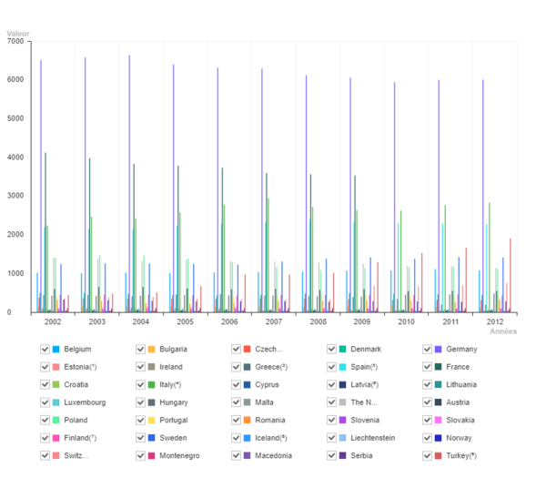
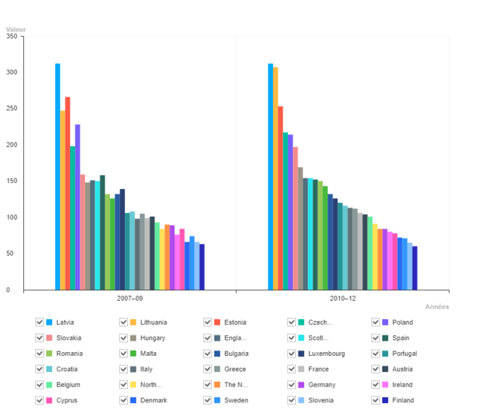

# Challenge Data Visualisation - Utilisation de la libraire ToastUI Chart &#x1F4C8; &#x1F4CA;

## Description 

Ce projet a pour but de réaliser une visualisation de données statiques et en temps réel en utilisant la libraire ToastUI Chart. Le challenge consistait en la création de 3 graphiques: deux graphiques construits à partir de données statiques (présentes dans deux tableau distincts) et un graphique en temps réel (données disponibles dans une API).

Graphique 1 (ID`graph1`):

Ce graphique présente les données statiques du premier tableau (#table1). Ces données sont le nombre de crimes enregistrés par année par la police (de 2002 à 2012). Les statistiques de 37 pays y sont analysées.



Graphique 2 (ID`graph2`):

Ce graphique présente les données statiques du deuxième tableau (#table2). Ces données sont le nombre de détenus de chaque pays pour 100000 habitants. Deux tranches de périodes sont comparées (2007-2009 et 2010-2012).



Graphique 3 (ID`graph3`):

Ce graphique présente les données en temps réel. Les données sont récupérées d'une API à l'URL : https://canvasjs.com/services/data/datapoints.php. Ces données sont mises à jour dans l'API chaque seconde et sont également mise à jour dans le grpahique au même interval. 


Une version ***Live*** de ces 3 graphiques est disponible à l'adresse : https://stevenmottiaux.github.io/Challenge-Data-Visualisation-ToastUI-Chart/

## Fonctionnalités

- Visualisation de données en temps réel
- Mise à jour de la visualisation en temps réel
- Évolution de la valeur des données en temps réel
- Possibilité d'export sous plusieurs formats (PNG, JPG, XLS, CSV)

## Explication du Code pour le Graphique 3 (en temps réel) 	&#x2139;

### scripts/scripts.cjs

Le fichier `./scripts/scripts.cjs` contient le code JavaScript qui permet de récupérer les données depuis une API et de les afficher dans un graphique en temps réel.

1. **Récupération des données** :
   ```javascript
   $.getJSON("https://canvasjs.com/services/data/datapoints.php", function(data) {
     $.each(data, function(index, value) {
       data3.push({
         x: value[0],
         y: parseFloat(value[1]),
       });
     });
   });
   ```
   Cette partie du code utilise la méthode `$.getJSON` de jQuery pour récupérer les données depuis l'API. Les données sont ensuite ajoutées au tableau `data3`.

2. **Calcul des valeurs minimales et maximales** :
   ```javascript
   data3.forEach((value) => {
     if (value.y < minValue3) minValue3 = value.y;
     if (value.y > maxValue3) maxValue3 = value.y;
   });
   ```
   Cette boucle parcourt les données pour trouver les valeurs minimales et maximales de `y`.

3. **Création du graphique** :
   ```javascript
   const el3 = document.getElementById("graph3");
   const dataGraph3 = {
     categories: data3.map(point => point.x),
     series: [{
       name: "Série 1",
       data: data3.map(point => point.y)
     }]
   };
   const optionsGraph3 = {
     chart: { width: 800, height: 600 },
     yAxis: {
       title: "Y",
       tick: {
         interval: interval3,
       },
       min: minValue3,
       max: maxValue3,
     },
     xAxis: {
       title: "X",
       tick: {
         interval: 1,
       },
     },
     series: {
       shift: true,
     },
   };
   const chart = Chart.lineChart({ el: el3, data: dataGraph3, options: optionsGraph3 });
   ```
   Cette partie du code crée le graphique en utilisant la librairie ToastUI Chart. Les données et les options du graphique sont définies, puis le graphique est créé et affiché dans l'élément HTML avec l'ID `graph3`.

4. **Mise à jour du graphique en temps réel** :
   ```javascript
   function updateChart() {
     $.getJSON("https://canvasjs.com/services/data/datapoints.php", function(newData) {
       $.each(newData, function(key, value) {
         data3.push({
           x: parseInt(value[0]),
           y: parseInt(value[1])
         });
       });
     });
     chart.addData(data3.map(point => point.y), data3.map(point => point.x));
     setInterval(updateChart, 1000);
     updateChart();
   }
   ```
   La fonction `updateChart` récupère les nouvelles données de l'API et les ajoute au graphique. Cette fonction est appelée toutes les secondes pour mettre à jour le graphique en temps réel.

### index.html

Le fichier `./index.html` contient la structure HTML de la page, y compris les éléments où les graphiques sont affichés. Il inclut également les scripts nécessaires pour faire fonctionner les graphiques.

1. **Inclusion des scripts** :
   ```html
   <script src="./node_modules/jquery/dist/jquery.min.js"></script>
   <script src="https://uicdn.toast.com/chart/latest/toastui-chart.min.js"></script>
   <script src="./scripts/scripts.cjs"></script>
   ```
   Ces lignes incluent les bibliothèques jQuery et ToastUI Chart, ainsi que le fichier `scripts.cjs` qui contient le code JavaScript pour les graphiques.

2. **Élément du graphique** :
   ```html
   <div id="graph3"></div>
   ```
   Cet élément HTML est l'endroit où le graphique en temps réel sera affiché.


